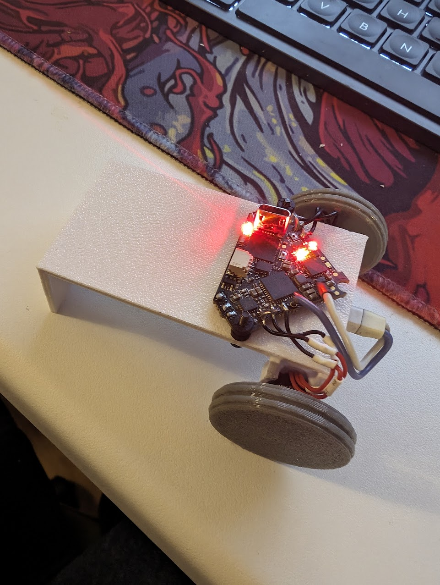
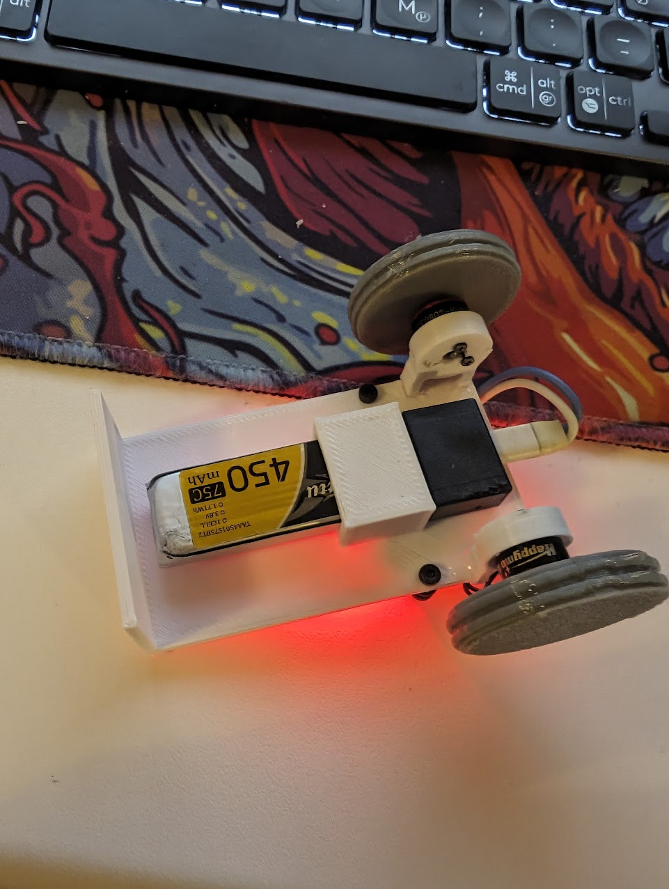

# Ping-Pong og RC biler

Her er loggen min for de to prosjektene jeg og Olav jobbet på

# RC bil av drone deler

Når jeg og Olav planla ideen vår var det første vi tenkte på en radiostyrt bil. Begge oss er veldige glade og har drevet mye med den radiostyrte hobbyen, og mer spesielt droner. Dette gjorde at vi hadde en god del halvfungerende dronedeler liggende allerede. Vi ville se om vi kunne lage dette om til en radiostyrt bil. Og etter litt planlegging var vi sikre på at dette var noe som kunne bli gjort.

## Delene
Delene vi hadde tekt til å bruke måtte følge noen kriterier.

1. Delene må være noe vi allerede har og ikke bruker
2. De må være kompatible med hverandre
3. Vesentlig små

For å gjøre prosjektet miljøbesparende ville vi bare bruke deler vi allerede hadde og ikke brukte, som i det forrige prosjektet. Og grunnen til at vi ville at delene skulle være små var fordi vi ville gjøre bilen innendørs venlig.

Dette var vår første sketch som vi lagde den første timen på skolen:  


### Hjernen til bilen
For å styre bilen trengte den en hjerne som kunne bli kontrollert av en radiokontrolleren (litt som en gaming kontroller for RC), styre motorene, og strømme det kameraet ser til en skjerm. Olav hadde flight controlleren "Happymodel Diamond F4" liggende. Denne flight controlleren er laget for veldig små droner, men passer perfekt til det vi skulle bruke den til. Grunnen til at Olav ikke brukte den lenger var fordi bare 3 av motorene man koblet til den funket, heldigvis trengte vi bare 2 til hjulene bak. Denne flight controlleren er formet som en trekant, og derfor er sketchen sånn også.  

### Motorene

Motorene vi hadde tenkt til å bruke var mine SE0802 25000KV motorer. Disse motorene er på størrelse med en negl, men spinner fortsatt sinnsykt raskt. Jeg har hatt disse motorene støve i en skuff i et halvt år nå etter at jeg ødela dronen som brukte de og gadd aldri å kjøpe nye deler til den dronen. Bilde av motorene på den nå ødelagte dronen:  


### Hjul

Bilen vår trengte hjul (selvfølgelig). Siden akslene på motorene er såpass tynne (1mm) måtte vi designe våre egne. Dette var min jobb i arbeidsfordelingen. Siden jeg har tilgang til en 3D printer var det logisk å bruke den til hjulene.

Hjulene designet jeg i Blender som er et 3D modellerings program.  


Første design av hjulene:  


### Baseplaten

Platen hvor alle komponentene ble plassert var Olav sin jobb å designe, han laget også disse i Blender. De gikk gjennom mange forksjellige variasjoner. Disse platene 3D printet vi også. Vi brainstormet om det var noen andre mere miljøbesparende materialer vi kunne brukt, men vi innså at 3D printet PLA var det eneste som kunne ha våre komponenter festet til seg, og det tålte mye mer enn la oss si papp.

### Filament

I både ping-pong prosjektet og bil prosjektet bruker vi 3D printere for noen deler. Plastikken 3D printere bruker heter filament. Vi bruker mest PLA, PLA er et miljøbesparende filament fordi det er nedbrytbart, krever mindre energi og lager færre skadelige stoffer under printing enn andre filamenter, og forbrenningsprosessen er ikke like skadelig som vanlig plastikk. Vi passer også på å bruke det vi kaller reste-filament som er filament vi har liggende og kanskje ikke er så glad i, og ikke hadde brukt ellers. Når det kommer til hjul bruker vi TPU, dette er et gummi aktig filament som ofte gir bedre feste. TPU er også nedbrytbart, men produksjonesprosessen og forbrenningsprosessen er desverre ikke like ren som PLA, derfor prøver vi å bruke det så lite som mulig.

### Elektronikk

Også i begge prosjektene brukes elektronikk. Elektronikk er på ingen måte miljøbesparende, og uheldigvis blir en god del elektronikk produsert på dårlig måte. I bil prosjektet er hovedelektronikken fra Happymodel som er et kinesisk selskap og er nok devserre ikke så miljøbesparende. Men i ping-pong prosjektet bruker vi en Raspberry Pi, dette er et mere rent amerikansk selskap som har en renere produksjon av elektronikken. Siden elektronikk ikke er særlig miljøbesparende passer vi på å bare gjennbruke elektronikk vi allerede har.

## Prototype 1

Når vi kom hjem fra skolen etter vi hadde sketchet i Design og Redesign timen gikk vi rett til arbeid. Olav startet på designet av platen, og jeg begynte å gjøre klar elektronikken. Å gjøre klar elektronikken besto egentlig bare av å lodde på motorene.

### Konfigurasjon
Men før jeg kunne gjøre klar komponentene måtte jeg konfigurere flight controlleren. Dette gjør jeg gjennom et program som heter Betaflight Configurator. Protokollen denne flight controlleren bruker for å koble til radiokontrolleren min heter ELRS, siden dette er en SPI ELRS reciever er å koble de to sammen så lett som å bare putte inn et passord som kobler dem sammen.


Nå kunne jeg styre flight controlleren med radiokontrolleren min.

En veldig viktig funksjon alle flight controllere har som er viktig for å holde droner stabile i lufta er at selvom du har armet dronen (å "arme" en drone er som å skru av sikkerheten på et gevær) så kommer motorene til å spinne selv når throttlen er på bunn (throttle er joysticken på radiokontrolleren som styrer hastighet på motorene). Dette er jo ikke optimalt for en bil hvor vi vil ha bilen til å stå stille når throttle stikken er helt nede. Heldigvis vår å fikse dette så lett som å skru på en switch.


### Bygging og lodding
Loddingen var ganske straight forward tok bare litt tid fordi hver motor har 3 ledninger, 6 ledninget til sammen, og tre av de lendingene måtte forlenges, så til sammen 9 loddinger.  


Etter at begge motorene var loddet på, og Olav sin baseplate printet kunne jeg sette alt sammen med noen M2 skruer.


Batteriet vi endte opp med å bruke var et Tattu 1s 450mah lipo batteri. Dette batteriet har en celle med 4.35 volt som er nok til å gi strøm til hele bilen, og de 450 amperetimene lar bilen kjøre lenge nok. Siden vi ikke hadde tenkt på noe god måte å feste batteriet på enda ble en strikk løsningen.


Videoen av den første testen tror jeg sier seg selv:

[Video av første test](https://youtube.com/shorts/QQjjO0h9N5E)

## Prototype 2

Vårt første instinkt var å forbedre motor holderne så ikke hjulene skulle fly avgårde. Og det gjorde vi. Nå var skruehullene til motorene passe store så skruene faktisk kunne feste seg.

[Video av prototype 2](https://youtube.com/shorts/Ng86TNDHwoM)

## Prototype 3

Prototype nr. 2 hadde en rekke problemer:
- Batteriet plugget ut (det var pipelyden)
- Batteriet er festet med en strikk
- Hjulene hadde ikke noe feste i bakken
- Motorne var vanskelig å montere

Vi innså at Olav måtte design en ny baseplate for komponentene. Denne måtte ha en holder for batteriet og motor holdere som var lettere å feste motorne til.

Jeg startet også på å designe noen nye hjul som hadde bedre feste, for å gjøre det la jeg til spor i hjulene og printet hjulene i TPU som festet bedre til gulvet.

Her er den nye bilen, vi snudde også flight controlleren for å spre vekten likt.




[Prototype 3 video](https://youtube.com/shorts/JYf0C7H8rQk)

I videoen kjørte jeg kun med den laveste farten mulig, så jeg tok en ny test hvor jeg tok full gass.

[Full gass!](https://youtube.com/shorts/O1NQhZz3u_M)

## Der det går nedover

Som man kan se i testen med full gass kjører bilen ekstremt sakte. Vi visste også at dette ikke var et problem med noen av komponente, fordi vi testet de på bordet [her](https://youtube.com/shorts/-pAE5eclOGs).

Vår første tanke var at kanskje ikke hjulene ikke hadde nok feste. Men det kan ikke stemme ettersom at hvis det hadde vært problemet hadde hjulene spunnet løst rundt som i [prototype 1](https://youtube.com/shorts/QQjjO0h9N5E).

Det vi også tenkte kunne være problemet var en betaflight funksjon som heter "runaway". Dette er en veldig lur funksjon som stopper / sakker ned motorene hvis motorene blir for varme, er under for mye belasting, en motor ledning har røket, etc. Vi tenkte at kanskje runaway merket at det var for mye motstand å flytte seg på et gulv i motsetning til i lufta. Å skur av runaway er veldig lett, men er også en veldig dårlig idee hvis man ikke er veldig sikre på hva man gjør. Heldigvis kan ikke bilen vår gjøre så mye skade i motsetning til si en drone med 4 skarpe propeller. Kommandoen for å skru av runaway:
```
set runaway_takeoff_prevention = OFF
```

[Video av kjøring med runaway av](https://youtube.com/shorts/QwqdcotDesQ)

Dette fikset desverre ikke problemet med farten, men som man kan se i videoen gjorde det kjøringen mere smooth.

Men hva er galt med at bilen kjører litt sakte? Hører jeg deg si, vel ikke bare kjører den sakte, men den er også umulig å styre når motorene kjører som det her.

Det som endte opp med å være problemet vårt er at ESCen ikke er kraftig nok. ESCen er en komponent på flight controlleren som styrer hastigheten og strømmen som går til motorene. ESCen i vår flight controller tåler ikke såpass mye motstand på motorene og for å ikke ødelegge seg selv senker den hastigheten. En morsom ting er at jeg ødele engang en ESC ved at når jeg kræsjet stoppet motorene såpass fort at motstanden for ESCen var for mye og endte opp med å brenne ESCen, så dette var noe jeg visste vi ikke skulle tukle med.

## Prototype 4

Etter en god del brainstorming og leting i skuffer og skap fant vi en god ide.

Jeg hadde liggene en flight controller som kunne ta 2s batterier. Dette betydde at flight controlleren fikk dobbelt så mye strøm, motorene kunne være sterkere, og ESCen tålte mere. Hvorfor brukte vi ikke denne in the first place? Jo fordi VTXen det som sender det kameraet ser til skjermen vår ikke funker, så planen var å senere montere den andre flight controlleren oppå kun for kamera.

[Video av første test med sterkere komponenter](https://youtube.com/shorts/oO1Mb_OD9XM)

Olav endret designe på den originale baseplaten for å passe de nye komponentene. Og jeg monterte de sammen. Her igjen hadde vi noen problemer, jeg tror videoen snakker for seg selv.  
[Video]()