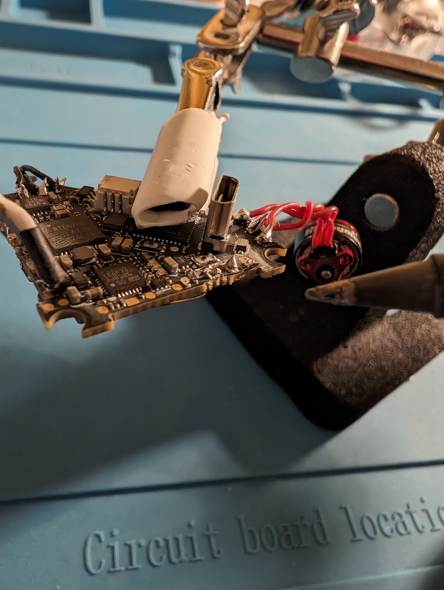

# Ping-Pong og RC biler

Her er loggen min for de to prosjektene jeg og Olav jobbet på

# RC bil av drone deler

Når jeg og Olav planla ideen vår var det første vi tenkte på en radiostyrt bil. Begge oss er veldige glade og har drevet mye med den radiostyrte hobbyen, og mer spesielt droner. Dette gjorde at vi hadde en god del halvfungerende dronedeler liggende allerede. Vi ville se om vi kunne lage dette om til en radiostyrt bil. Og etter litt planlegging var vi sikre på at dette var noe som kunne bli gjort.

## Delene
Delene vi hadde tekt til å bruke måtte følge noen kriterier.

1. Delene må være noe vi allerede har og ikke bruker
2. De må være kompatible med hverandre
3. Vesentlig små

For å gjøre prosjektet miljøbesparende ville vi bare bruke deler vi allerede hadde og ikke brukte, som i det forrige prosjektet. Og grunnen til at vi ville at delene skulle være små var fordi vi ville gjøre bilen innendørs venlig.

Dette var vår første sketch som vi lagde den første timen på skolen:  

### Hjernen til bilen
For å styre bilen trengte den en hjerne som kunne bli kontrollert av en fjernkontroll, styre motorene, og strømme det kameraet ser til en skjerm. Olav hadde flight controlleren "Happymodel Diamond F4" liggende. Denne flight controlleren er laget for veldig små droner, men passer perfekt til det vi skulle bruke den til. Grunnen til at Olav ikke brukte den lenger var fordi bare 3 av motorene man koblet til den funket, heldigvis trengte vi bare 2 til hjulene bak. Denne flight controlleren er formet som en trekant, og derfor er sketchen sånn også.  

### Motorene

Motorene vi hadde tenkt til å bruke var mine SE0802 25000KV motorer. Disse motorene er på størrelse med en negl, men spinner fortsatt sinnsykt raskt. Jeg har hatt disse motorene støve i en skuff i et halvt år nå etter at jeg ødela dronen som brukte de og gadd aldri å kjøpe nye deler til den dronen. Bilde av motorene på den nå ødelagte dronen:  

### Hjul

Bilen vår trengte hjul (selvfølgelig). Siden akslene på motorene er såpass tynne (1mm) måtte vi designe våre egne. Dette var min jobb i arbeidsfordelingen. Siden jeg har tilgang til en 3D printer var det logisk å bruke den til hjulene.

Hjulene designet jeg i Blender som er et 3D modellerings program.  

Første design av hjulene:  

### Baseplaten

Platen hvor alle komponentene ble plassert var Olav sin jobb å designe, han laget også disse i Blender. De gikk gjennom mange forksjellige variasjoner. Disse platene 3D printet vi også. Vi brainstormet om det var noen andre mere miljøbesparende materialer vi kunne brukt, men vi innså at 3D printet PLA var det eneste som kunne ha våre komponenter festet til seg, og det tålte mye mer enn la oss si papp.

### Filament

I både ping-pong prosjektet og bil prosjektet bruker vi 3D printere for noen deler. Plastikken 3D printere bruker heter filament. Vi bruker mest PLA, PLA er et miljøbesparende filament fordi det er nedbrytbart, krever mindre energi og lager færre skadelige stoffer under printing enn andre filamenter, og forbrenningsprosessen er ikke like skadelig som vanlig plastikk. Vi passer også på å bruke det vi kaller reste-filament som er filament vi har liggende og kanskje ikke er så glad i, og ikke hadde brukt ellers. Når det kommer til hjul bruker vi TPU, dette er et gummi aktig filament som ofte gir bedre feste. TPU er også nedbrytbart, men produksjonesprosessen og forbrenningsprosessen er desverre ikke like ren som PLA, derfor prøver vi å bruke det så lite som mulig.

### Elektronikk

Også i begge prosjektene brukes elektronikk. Elektronikk er på ingen måte miljøbesparende, og uheldigvis blir en god del elektronikk produsert på dårlig måte. I bil prosjektet er hovedelektronikken fra Happymodel som er et kinesisk selskap og er nok devserre ikke så miljøbesparende. Men i ping-pong prosjektet bruker vi en Raspberry Pi, dette er et mere rent amerikansk selskap som har en renere produksjon av elektronikken. Siden elektronikk ikke er særlig miljøbesparende passer vi på å bare gjennbruke elektronikk vi allerede har.

## Første design

Når vi kom hjem fra skolen etter vi hadde sketchet i Design og Redesign timen gikk vi rett til arbeid. Olav startet på designet av platen, og jeg begynte å gjøre klar elektronikken. Å gjøre klar elektronikken besto egentlig bare av å lodde på motorene.

Loddingen var ganske straight forward tok bare litt tid fordi hver motor har 3 ledninger, 6 ledninget til sammen, og tre av de lendingene måtte forlenges, så til sammen 9 loddinger.  

Etter at begge motorene var loddet på, og Olav sin baseplate printet kunne jeg sette alt sammen med noen M2 skruer.

Batteriet vi endte opp med å bruke var et Tattu 1s 450mah lipo batteri. Dette batteriet har en celle med 4.35 volt som er nok til å gi strøm til hele bilen, og de 450 amperetimene lar bilen kjøre lenge nok. Siden vi ikke hadde tenkt på noe god måte å feste batteriet på enda ble en strikk løsningen.

Videoen av den første testen tror jeg sier seg selv:

https://youtube.com/shorts/QQjjO0h9N5E

Så ja det gikk ikke helt etter planen