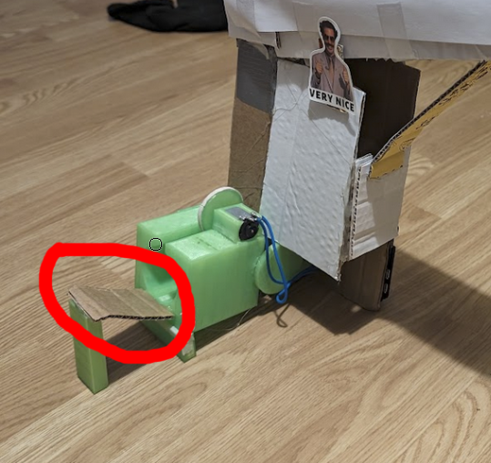

# Ping-Pong og RC biler

Her er loggen min for de to prosjektene jeg og Olav jobbet på

# RC bil av drone deler

Når jeg og Olav planla ideen vår var det første vi tenkte på en radiostyrt bil. Begge oss er veldige glade i og har drevet mye med den radiostyrte hobbyen, og mer spesielt droner. Dette gjorde at vi hadde en god del halvfungerende dronedeler liggende allerede. Vi ville se om vi kunne lage dette om til en radiostyrt bil. Og etter litt planlegging var vi vesentlig sikre på at dette var noe som kunne bli gjort.

## Delene

Delene vi hadde tenkt til å bruke måtte følge noen kriterier.

1. Delene må være noe vi allerede har og ikke bruker
2. De må være kompatible med hverandre
3. Vesentlig små

For å gjøre prosjektet miljøbesparende ville vi bare bruke deler vi allerede hadde og ikke brukte, som i det forrige prosjektet. Og grunnen til at vi ville at delene skulle være små var fordi vi ville gjøre bilen innendørs vennlig.

Dette var vår første sketch som vi lagde den første timen på skolen:


### Hjernen til bilen

For å styre bilen trengte den en hjerne som kunne bli kontrollert av en radiokontroller (litt som en gaming kontroller for RC) for å styre motorene, og strømme det kameraet ser til en skjerm. Til dette trengte vi en "flight controller" dette er et elektronisk komponent som i hovedsak er hjernen til dronen, men det vi har er en AIO, det betyr at den inkluderer en flight controller, 4 ESCer en ESC står for "electronic speed controller" og trengs for at flight controlleren skal kunne styre motorene", den kommer også med en VTX som strømmer det er kamera ser over 5,8ghz båndet, og til slutt en reciever vi kan koble kontrolleren vår til. Olav hadde flight controlleren "Happymodel Diamond F4" liggende. Denne flight controlleren er laget for veldig små droner, men passer perfekt til det vi skulle bruke den til. Grunnen til at Olav ikke brukte den lenger var fordi bare 3 av motorene man koblet til den funket, heldigvis trengte vi bare 2 til hjulene bak. Denne flight controlleren er formet som en trekant, og derfor er sketchen sånn også.

### Motorene

Motorene vi hadde tenkt til å bruke var mine Happymodel SE0802 25000KV motorer. Disse motorene er på størrelse med en negl, men spinner fortsatt sinnsykt raskt. Jeg har hatt disse motorene i en skuff i et halvt år nå etter at jeg ødela dronen som brukte de og gadd aldri å kjøpe nye deler til den dronen. Bilde av motorene på den nå ødelagte dronen:


### Hjul

Bilen vår trengte hjul (selvfølgelig). Siden akslene på motorene er såpass tynne (1mm) måtte vi designe våre egne. Dette var min jobb i arbeidsfordelingen. Siden jeg har tilgang til en 3D-printer var det logisk å bruke den til hjulene.

Hjulene designet jeg i Blender som er et 3D-modellerings program.  


Første design av hjulene:


### Baseplaten

Platen hvor alle komponentene ble plassert var Olav sin jobb å designe, han laget også disse i Blender. De gikk gjennom mange foskjellige variasjoner. Disse platene 3D-printet vi også. Vi brainstormet om det var noen andre mere miljøbesparende materialer vi kunne brukt, men vi innså at 3D printet PLA var det eneste som kunne ha våre komponenter festet til seg presist nok, og det tålte mye mer enn noe som papp.

### Filament

I både ping-pong prosjektet og bil prosjektet bruker vi 3D printere for noen deler. Plastikken 3D printere bruker heter filament. Vi bruker mest PLA, det er et miljøbesparende filament fordi det er nedbrytbart, krever mindre energi og lager færre skadelige stoffer under printing enn andre filamenter, og forbrenningsprosessen er ikke like skadelig som vanlig plastikk. Vi passer også på å bruke det vi kaller reste-filament som er filament vi har liggende og kanskje ikke er så glad i, og ikke hadde brukt ellers. Når det kommer til hjul bruker vi TPU, dette er et gummi aktig filament som ofte gir bedre feste. TPU er også nedbrytbart, men produksjonsprosessen og forbrenningsprosessen er desverre ikke like ren som PLA, derfor prøver vi å bruke det så lite som mulig.

### Elektronikk

Også i begge prosjektene brukes elektronikk. Elektronikk er på ingen måte miljøbesparende, og uheldigvis blir en god del elektronikk produsert på dårlig måte. I bil prosjektet er hovedelektronikken fra Happymodel som er et kinesisk selskap og er nok desverre ikke så miljøbesparende. Det som kan bli sagt derimot er at Happymodel sender med båt istedenfor fly som er mere miljøvenlig. Men i ping-pong prosjektet bruker vi en Raspberry Pi, dette er et mere rent selskap som har en renere produksjon av elektronikken. Siden elektronikk ikke er særlig miljøbesparende passer vi på å bare gjenbruke elektronikk vi allerede har.

## Prototype 1

Når vi kom hjem fra skolen etter vi hadde sketchet i Design og Redesign timen gikk vi rett til arbeid. Olav startet på designet av platen, og jeg begynte å gjøre klar elektronikken. Å gjøre klar elektronikken besto egentlig bare av å lodde på motorene, og å konfigurere den på PCen.

### Konfigurasjon

Før jeg kunne gjøre klar komponentene måtte jeg konfigurere flight controlleren. Dette gjør jeg gjennom et program som heter Betaflight Configurator. Protokollen denne flight controlleren bruker for å koble til radiokontrolleren min heter ELRS, siden dette er en SPI ELRS reciever er å koble de to sammen så lett som å bare putte inn et passord som kobler dem sammen.


Nå kunne jeg styre flight controlleren med radiokontrolleren min.

En veldig viktig funksjon alle flight controllere har som er viktig for å holde droner stabile i lufta er at selv om du har armet dronen (å "arme" en drone er som å skru av sikkerheten på et gevær) så kommer motorene til å spinne selv når throttlen er på bunn (throttle er joysticken på radiokontrolleren som styrer hastighet på motorene). Dette er jo ikke optimalt for en bil hvor vi vil ha bilen til å stå stille når throttle stikken er helt nede. Heldigvis vår å fikse dette så lett som å skru på en switch.


### Bygging og lodding

Loddingen var ganske straight forward tok bare litt tid fordi hver motor har 3 ledninger, 6 ledninger til sammen, og tre av de lendingene måtte forlenges, så til sammen 9 ledninger loddet. For lodding brukte jeg et blyinnholdig 63/37 flux core loddetinn. Dette gjør loddeprosessen mye bedre.


Etter at begge motorene var loddet på, og Olav sin baseplate printet kunne jeg sette alt sammen med noen M2 skruer.


Batteriet vi endte opp med å bruke var et Tattu 1s 450mah lipo batteri. Dette batteriet har en celle med 4.35 volt som er nok til å gi strøm til hele bilen, og de 450 amperetimene lar bilen kjøre lenge nok. Siden vi ikke hadde tenkt på noe god måte å feste batteriet på enda ble en strikk løsningen.


Videoen av den første testen tror jeg sier seg selv:

[Video av første test](https://youtube.com/shorts/QQjjO0h9N5E)

## Prototype 2

Vårt første instinkt var å forbedre motor holderne så ikke hjulene skulle fly av gårde igjen. Og det gjorde vi. Nå var skruehullene til motorene passe store så skruene faktisk kunne feste seg.

[Video av prototype 2](https://youtube.com/shorts/Ng86TNDHwoM)

## Prototype 3

Prototype nr. 2 hadde en rekke problemer:

- Batteriet plugget ut (det var pipelyden)
- Batteriet er festet med en strikk
- Hjulene hadde ikke noe feste i bakken
- Motorene var vanskelig å montere

Vi innså at Olav måtte design en ny baseplate for komponentene. Denne måtte ha en holder for batteriet og motor holdere som var lettere å feste motorne til.

Jeg startet også på å designe noen nye hjul som hadde bedre feste, for å gjøre det la jeg til spor i hjulene og printet hjulene i TPU som festet bedre til gulvet.

Her er den nye bilen, vi snudde også flight controlleren for å spre vekten likt.


[Prototype 3 video](https://youtube.com/shorts/JYf0C7H8rQk)

I videoen kjørte jeg kun med den laveste farten mulig, så jeg tok en ny test hvor jeg tok full gass.

[Full gass!](https://youtube.com/shorts/O1NQhZz3u_M)

## Der det går nedover

Som man kan se i testen med full gass kjører bilen ekstremt sakte. Vi visste også at dette ikke var et problem med noen av komponentene, fordi vi testet de på bordet [her](https://youtube.com/shorts/-pAE5eclOGs).

Vår første tanke var at kanskje ikke hjulene ikke hadde nok feste. Men det kan ikke stemme ettersom at hvis det hadde vært problemet hadde hjulene spunnet løst rundt som i [prototype 1](https://youtube.com/shorts/QQjjO0h9N5E).

Det vi også tenkte kunne være problemet var en betaflight funksjon som heter "runaway". Dette er en veldig lur funksjon som stopper / sakker ned motorene hvis motorene blir for varme, er under for mye belasting, en motor ledning har røket, etc. Vi tenkte at kanskje runaway merket at det var for mye motstand å flytte seg på et gulv i motsetning til i lufta. Å skur av runaway er veldig lett, men er også en veldig dårlig ide hvis man ikke er veldig sikre på hva man gjør. Heldigvis kan ikke bilen vår gjøre så mye skade i motsetning til si en drone med 4 skarpe propeller. Kommandoen for å skru av runaway:

```
set runaway_takeoff_prevention = OFF
```

[Video av kjøring med runaway av](https://youtube.com/shorts/QwqdcotDesQ)

Dette fikset desverre ikke problemet med farten, men som man kan se i videoen gjorde det kjøringen mere smooth.

Men hva er galt med at bilen kjører litt sakte? Vel ikke bare kjører den sakte, men den er også umulig å styre når motorene kjører som det her.

Det som endte opp med å være problemet vårt er at ESCen ikke er kraftig nok. ESCen er en komponent på flight controlleren som styrer hastigheten og strømmen som går til motorene. ESCen i vår flight controller tåler ikke såpass mye motstand på motorene og for å ikke ødelegge seg selv senker den hastigheten. En morsom ting er at jeg ødela engang en ESC ved at når jeg kræsjet stoppet motorene såpass fort at motstanden for ESCen var for mye og endte opp med å brenne ESCen, så dette var noe jeg visste vi ikke skulle tukle med.

## Prototype 4

Etter en god del brainstorming og leting i skuffer og skap fant vi en god ide.

Jeg hadde liggene en flight controller som kunne ta 2s batterier. Dette betydde at flight controlleren fikk dobbelt så mye strøm, motorene kunne være sterkere, og ESCen tålte mere. Hvorfor brukte vi ikke denne in the first place? Jo fordi VTXen det som sender det kameraet ser til skjermen vår ikke funker, så planen var å senere montere den andre flight controlleren oppå kun for kameraet.

[Video av første test med sterkere komponenter](https://youtube.com/shorts/oO1Mb_OD9XM)

Olav endret designe på den originale baseplaten for å passe de nye komponentene. Og jeg monterte de sammen. Her igjen hadde vi noen problemer, jeg tror videoen snakker for seg selv.  
[Video](https://youtube.com/shorts/jKkWEIeuQS0)

Motorene satt for løst og konfigurasjonen for motorene var feil så de spant feil vei. Etter å ha printet nye hjul som passet bedre, og rekonfigurert motorene så de spinner riktig vei hadde vi en god del tester hvor hjulene bare spant løst på gulvet. Løsningen vi kom opp med var å feste strikker på hjulet.  
[Resultatet av strikker på hjulene](https://youtube.com/shorts/CIFSEfY2Mvc)

Som man kan se gikk bilen unna for å si det mildt. Problemet var at dette var med minst mulig gass. Vi prøvde flere forskjellige måter å sakke ned motorene på, men ingen fikk den til å gå særlig mye saktere. Dette var den mest irriterende tingen vi kom over, de andre prototypene var for trege til å bli kontrollert, og denne var for rask til å bli kontrollert.

# Brainstorming

Vi innså at vi måtte finne en ny ide, så vi gikk rett til brainstorming. Noen av ideene vi kom opp med var blant annet:
- fjernstyrt lysbryter
- Automatisk nerf pistol
- Ping-pong ball skyter

Det vi endte opp med var ping-pong skyteren

# Ping-pong skyter

Planen var å lage en maskin man kunne bruke til å øve på bordtennis alene.

Vi brukte et online program som heter "miro" for å kunne sketche en ide sammen. Og dette var første sketch:  


Planen besto av tre deler:

## Skyteren

Mekanismen for å skyte ut selve ballene lå fremst i maskinen. På den første sketchen var planen å bruke to motorer med hjul for å spinne ut ballen. Dette er samme måte nerf pistoler og tennis skytere funker på. Dette var det olav skulle lage

## Magasinet

Over skyte mekanismen måtte det være et magasin hvor man kunne lagre baller, men også en mekanisme for å bestemme når en ball skulle bli sluppet inn i skyteren.

Første plan for ball fordelingen (systemet som styrer når en ball blir skutt) var å lage gangen inn til skyteren akkuratt litt for liten for ballen til å trille gjennom, og så bruke en motor til å dytte ballen gjennom når vi ville skyte.  

 

 Selv før jeg lagde denne ideen fysisk fant jeg en bedre løsning. Det var å bruke en roterende motor med armer som kunne laste inn en og en ball. Tegningen her har noen problemer som vi kommer til senere.  
 

 Det var min jobb å bygge ballfordelingen og Olav sin jobb å bygge magasinet.

 ## Å bygge magasinet

 ### Materialer

 Jeg bestemte meg for å bygge tuben rundt systemet av resirkulert papp. Dette var for å holde bygget mest mulig miljøbesparende som mulig. 

 Armen man kan se på bildet 3d printet jeg av filament, for å gjøre det stødig nok og passe dimensjonene, jeg skrev om miljøbesparligheten til PLA [her](#filament)

 Motoren jeg brukte heter en stepper motor. Det er en spesiell motor som kobles til en chip, denne chipen styrer motoren i små "steps" som gjør at motoren kan styres veldig presist, akkuratt det jeg trenger. I en rotasjon er det 4096 individuelle "steps".

### Prototype 1

 Første prototype var bare for å se om dette ville funke i det hele tatt, derfor brukte jeg minst mulig materialer som mulig, og minst mulig tid. Her er en video av første prototype.  

 [Første prototype](https://youtu.be/wClO_wcjor0)

 ### Prototype 2

 Jeg innså jo hvor dårlig jeg hadde satt opp systemet i den første prototypen. Nå istedenfor å ha motoren og hjulet direkte inne i røret lå det på utsiden med armer stikkende inn. Jeg tror videon forklarer det bedre. [video](https://youtube.com/shorts/VSZZech8jSM)

 Her brukte jeg noen små pinne ting jeg fant liggende i hobby skuffen for å forlenge armene. Jeg glemte å filme at den roterte, men problemet her var at armene var for langt unna hverandre så to baller ble med ned.  
 
 

 ### Nye armer!

 Jeg skjønte at her var å legge til flere armer løsningen. Jeg gikk vekk fra å bruke de pinnene ettersom at de viste seg å ikke være særlig strukturelt sterke.

 [Video av nye armer](https://youtube.com/shorts/QrIoHUfi8oQ)

Dette som man kunne se funket jo, sånn halveis. Hypotesen min var at det var to armer for mye, som gjorde at ballen satt seg sånn rart mellom armene.

Derfor designet jeg en ny versjon med seks armer istedenfor 8.

[Seks armer video](https://youtube.com/shorts/YYM5-XYwLgA)

Dette gjorde akkuratt det jeg trengte, og selve mekanismen var ferdig!

## Oppmøte på skolen

2 uker etter prosjektet startet tok vi med det vi hadde til skolen. Olav hadde jobbet på skyte systemet i mellomtiden. Vi hadde begge snakket over nett mens vi jobbet så vi visste hva begge drev med. Derfor kunne vi også hjelpe hverandre når vi satt fast på problemer.

På skolen la  vi til en strikk på hjulet til skyteren for bedre grep på ballen. Og testet litt andre greier, men mesteparten av tiden ble brukt til å brainstorme hvordan vi skulle fortsette å bygge ut prosjektet. Men vi fikk også rigget sammen et midlertidig setup for å skyte noen ping-pong baller!

[Første skudd video!](https://youtube.com/shorts/ojOTOftyVaE)

## Programvaren

Hittil hadde jeg brukt [dette](servo.py) programmet til å styre motoren til ballfordelingssystemet. Måten det funket på var at jeg enten skrev inn antall rotasjoner eller "load" for å laste inn en ball. Dette funket under testing, men var uakseptabelt for et ferdig produkt. Derfor startet jeg på designet av nettsiden. Nettsiden skulel kjøre på en raspberry pi zero som er en liten Linux pc som kan kjøre små prgorammer,Nettsiden skulle ha tre moduser man kunne bytte mellom

- Statisk modus. Skyt en ball hvert x sekund
- Remote mode. Skut en ball hver gang du klikker på en fjernkontroll
- Random mode. En ball blir skutt med et tilfeldig mellomrom på 1 og 7 sekunder.

Her er en sketch av hvordan jeg hadde tenkt til å designe nettsiden:


 Siden dette var en komplisert og lang prosess skal jeg bare gå kjapt over hva som skjer i bakgrunnen her.

### HTML

HTML er et språk brukt for å strukturere innholdet til en nettside. HTML konfigurasjonen til nettsiden jeg lagde ser sånn her ut:

```html
<main>
    <h1>Ping Pong Loner</h1>

    <div id="choose_div" class="frame">
        <h3>Choose mode:</h3>

        <button class="button_choose" id="static_button" style="display: block;" onclick="showStatic()">Static mode</button>

        <button class="button_choose" id="remote_button" style="display: block;" onclick="showTrigger()">Remote mode</button>

        <button class="button_choose" id="random_button" style="display: block;" onclick="showRandom()">Random mode</button>

    </div>

    <div id="static_div" class="frame">
        <h3>Static firing mode</h3>
        <form action="/static_options" method="post">

            <div class="besides">
                <p>Interval,</p>
                <p>
                    <input type="text" class="text_form" name="interval" size="2"/>
                </p>
                <p>seconds</p>
            </div>

            <div class="clear-line"></div>

            <div class="besides">
                <p><input type="submit" value="Start" class="button"/></p>
                <p><button name="stopp" class="button" style="background-color: #bb2d3b;">Stop</button></p>
            </div>
        </form>

    </div>

    <div id="trigger_div" class="frame">
        <h3 id="trigger_title">Remote Trigger mode</h3>
        <form action="/trigger_options" method="post">
            <div class="besides">
                <p><input type="submit" value="Start" class="button" onclick="listen()"/></p>
                <p><button name="stopp" class="button" style="background-color: #bb2d3b;" onclick="stop_listen()">Stop</button></p>
            </div>
        </form>
    </div>

    <div id="random_div" class="frame">
        <h3>Random mode</h3>
        <form action="/random_options" method="post">
            <div class="besides">
                <p><input type="submit" value="Start" class="button"/></p>
                <p><button name="stopp" class="button" style="background-color: #bb2d3b;">Stop</button></p>
            </div>
        </form>
    </div>

</main>
```

Det er delt opp i fire grupper også kjent som "divs". Øverst ligger kondifurasjonen for knappene som bestemmer hvilke modus man er er på. Resten av gruppene ligner veldig på hverandre og er en for hver modus.

### CSS

CSS brukes for å "style" nettsiden og gjøre den fin. Uten CSS hadde nettsiden sett sånn her ut:


Derfor har jeg lagt til denne CSS konfigurasjonen:

```css
body {
    background-color: #090c10;
}

h1, h2, h3, p {
        font-family: 'Open Sans', sans-serif;
        font-family: BlinkMacSystemFont,segoe ui,Roboto,helvetica neue,Arial,noto sans,sans-serif,apple color emoji,segoe ui emoji,segoe ui symbol,noto color emoji;
        font-weight: 500;
        line-height: 1.2;
        color: #f0f6fc;
}

.frame {
    width: 50%;
    height: 30%;
    border: 1.5px solid #198754;
    padding-left: 10px;
    margin-bottom: 10px;
    border-radius: 15px;
    background-color: #0d1117;
}

.besides > * {
    display: inline-block;
    padding-right: 5px;
}

.clear-line {
    clear: both;
}

.text_form {
    border-color: #1d2634;
    color: #b1b8c0;
    padding: .375rem .75rem;
    border-radius: 50rem;
    background-color: #070a10;
    text-align: center;
}

.text_form input:focus {
    outline: 2px solid #198754;  
}

.button {
    width: 100px;
    height: 35px;
    border-radius: 50rem;
    background-color: #50b174;
    border-color: #1d2634;
    color: black;
    font-family: "Open Sans", sans-serif;
}

.button_choose {
    width: 150px;
    height: 35px;
    border-radius: 50rem;
    background-color: #556379;
    border-color: #1d2634;
    color: black;
    font-family: "Open Sans", sans-serif;
    margin: 10px;
}

#static_div {
    display: none;
}
```

Og med det kan nettsiden se sånn her ut:


### Javascript

Javascript er et programmeringssptråk i motsetning til HTML og CSS. Dette er det som gir nettsiden mesteparten av funksjonene sine. Sånn her ser javascript koden for nettsiden:

```javascript
var trigger_title = document.getElementById("trigger_div").getElementsByTagName("h3")[0];

function listen() {
    localStorage.setItem("listening", true);
}

function stop_listen() {
    localStorage.setItem("listening", false);
}

//Function to show listenign status
function show_listen_status() {
    var listening_status = localStorage.getItem("listening");
    if (listening_status === "true") {
        trigger_title.innerText = "Remote Trigger mode (listening)"
    }
    else if (listening_status === "false") {
        console.log("no listening")
        trigger_title.innerText = "Remote Trigger mode"
    }
}

// Function to show the selected tab based on the stored value
function showSelectedTab() {
    var selectedTab = localStorage.getItem("selectedTab");
    if (selectedTab) {
        // Hide all divs
        static_div.style.display = "none";
        trigger_div.style.display = "none";
        random_div.style.display = "none";

        // Reset background color of all buttons
        static_button.style.backgroundColor = "#556379";
        remote_button.style.backgroundColor = "#556379";
        random_button.style.backgroundColor = "#556379";

        // Show the selected tab and update button color
        if (selectedTab === "static") {
            static_div.style.display = "block";
            static_button.style.backgroundColor = "#50b174";
        } else if (selectedTab === "remote") {
            trigger_div.style.display = "block";
            remote_button.style.backgroundColor = "#50b174";
        } else if (selectedTab === "random") {
            random_div.style.display = "block";
            random_button.style.backgroundColor = "#50b174";
        }
    }
}

// Function to update the stored value when a tab is clicked
function updateSelectedTab(tabName) {
    localStorage.setItem("selectedTab", tabName);
}

// Event listeners to update the stored value and show/hide tabs when a tab is clicked
static_button.addEventListener("click", function() {
    updateSelectedTab("static");
    showSelectedTab();
});

remote_button.addEventListener("click", function() {
    updateSelectedTab("remote");
    showSelectedTab();
});

random_button.addEventListener("click", function() {
    updateSelectedTab("random");
    showSelectedTab();
});

// Call the showSelectedTab function when the page loads
if (localStorage.getItem("selectedTab") === null) {localStorage.setItem("selectedTab", "static")}
document.addEventListener("DOMContentLoaded", showSelectedTab);
document.addEventListener("DOMContentLoaded", show_listen_status);
```

Grunnen til at det er kommentarer her i javascript koden og ikke css og html er fordi html og css er lett å lese og skjønne med bare litt øvelse. Det Javascript koden min gjør er at når du bytter modus lagres modusen du er på i lokal lagring, så når du refresher siden er du på samme side. Og jabascript koden er også det som gjør at å bytte mellom moduser endrer det du ser på skjermen.

### Prøv det ut!

Hvis du laster ned filen [index.html](templates/index.html) og åpner den i en nettleser kan du prøve å navigere rundt på nettsiden. Bare ikke klikk "start" eller "stopp" fordi det vil ikke funke.

## Baksiden av nettsiden

Alle nettsider har det som kalles en "backend" det vi nettop gikk gjennom med html, css, og javascript kalles for "front end". Backenden ligger på serveren og behandler tilkoblingene til nettsiden, og i vårt tilfelle styrer den også motoren.

Backenden jeg lagde er skrevet i Python med Flask. Koden ligger [her](main.py) hvis du vil se på den. Her er hvordan alt funker:


Dette er veldig simplifisert, men gir ett overblikk

## Fjernkontrollen

Fjernkontrollen lagde jeg av en raspberry pi zero w, dette er et lite elektronisk brett med wifi som kan kjøre små python programmer. Jeg koblet til en knapp og skrev litt kode som koblet den opp til nettsiden.

## Møte på skolen nummer 2

Olav hadde også forbedret skyteren sin. Og planen var å bygge alt sammen nå. Olav hadde med limpistol, og jeg hadde med papp vi hadde hentet fra papirsøppla. Sammen satt vi sammen skyteren og ballfordeleren. Uheldigvis var vi altfor opptatt med det og glemte å ta bilder, men heldigvis var du jo der in person.

Siden vi ikke ble helt ferdig på skolen satt olav på skyteren hjemme med gjennbrukte prottype deler.


## Siste innspurt

### Tirsdag

På tirsdagen uka før presentasjonen møttes vi hos olav for å fikse de siste greiene. Det viktigste vi måtte fikse var å få ballen til å skyte litt oppover for å komme over nettet med ballen. Vi startet med å bare vippe hele maskinen, noe som funket til et visst punkt. Hvis vi gikk over det endte ballene opp med å ikke få nok fart til å gå inn i skyteren. Vår første fiks for dette var å flytte motoren nærmere magasinet så ballen ikke trengte å dra så langt. Dette funket også, men bare litt. Etter litt brainstorming endte vi opp med å lage en rampe av en papp bit og en 3d printet bit som skulle blitt brukt til å vippe den mere oppover. Denne rampen funket veldig bra og endte opp med å bli en del av slutt produktet. Men vi lot også litt av den originale oppvippingen være.



Noe annet vi hadde tenkt til å designe var en løsning for å lagre flere baller i magasinet. Det vi hadde tenkt fra starten var å lage en trakt form rundt toppen av magasinet hvor man kunne helle opp baller. Her er det eneste bilde jeg har av trakten...


Denne rakk vi ikke prøve før onsdagen.

### Onsdag

Onsdagen var vår siste sjanse til å fullføre prosjektet. Det første vi gjorde var å passe på at alt funket. Det gjorde det ikke. Trakten vi hadde laget dagen før endte opp med å gjøre så baller satt seg fast og ikke kom ned i magasinet. Vi prøvde å fikse dette med å ta et lag med gaffa teip over, noe som ikke funket. Løsningen ble å vrake trakten og designe en ny løsning. Løsningen vår å forlenge magasinet horisontalt, men med litt tilt. 


[Her](https://youtu.be/M56EKY8VWjA) er første ordentlig test av maskinen.

Ikke lenge etter dette måtte Olav dra, så jeg dro hjem for å fikse noen siste detaljer og for å sette sammen en kjapp powerpoint.

Når jeg kom hjem satt jeg et ark oppå det nye magasinet, dette er for å hindre at man kan se på fortid når en ball blir skutt, dette gjør det en god del vanskeligere.


Dette er sånn produktet fullført ble seende ut, jeg slang på et klistremerke for å kjule pizzabakeren logoen.


### Siste programvare endring

En siste ting jeg måtte fikse med programvaren var at nettsiden måtte starte av seg selv når jeg plugget den inn. For å gjøre dette konfigurerte jeg gunicorn som er et program for å kjøre Flask nettsider, og skrev et SystemD script for å starte den på boot. Jeg skrev mere om hvordan jeg gjorde det i min forrige logg [her](../NFC-musikkspiller/README.md#systemd)

### Powerpointen

Powerpointen jeg brukte satt jeg lett sammen med noen bullet-points og bilder, pluss at jeg fordelte hvem som skulle si hva.

## Fremføringen

Vi var selvfølgelig veldig spente på om alt kom til å funke under fremføringen. Noe jeg merket rett før folk begynte å fremføre var at fjernkontrollen ikke funket. Jeg fant ut av når jeg startet nettsiden ikke gjennom gunicorn funket det. jeg innså senere at det er fordi gunicorn bruker port 8000 mens bare Flask bruker port 9000. Dette hadde jeg ikke tid til å fikse, så vi var nødt til å starte webserveren manuelt når vi startet.

Vi hadde allerede plugget inn maskinen fra start så vi var sikre på at den var koblet til nettet fra telefonen min. Så når det var vår tur tok jeg fram laptopen og kjørte:

```
ssh simen@192.168.186.230 #for å koble til maskinen
```
```
cd ping-pong #bytt mappe til mappen med alle filene i
```
```
source env/bin/activate #aktiver python
```
```
python -m main.py #for å starte serveren
```
Nå burde alt være klart og vi startet å fremføre. Alt funket bra under demonstrasjoenn og vi var fornøyde. Folk likte produktet, og det var ingen spørsmål vi ikke kunne svare på. Når jeg kom hjem fikset jeg problemet med kontrolleren.

# Konklusjon

Jeg synes dette har vært et veldig morsomt prosjekt, jeg synes det er litt dumt at vi ikke fikk bygget bilen, men jeg fikk hvertfall programmert litt på det andre prosjektet så det er gøy. Jeg er også veldig glad for at jeg kom med Olav så jeg fikk muligheten til å bygge noe elektronisk som dette. Dette prosjektet var ikke i lik kompleksitet med det første, men det var fortsatt veldig gøy! Jeg synes også vi burde fortsette med å presentere hva man har bygget, det trenger jo ikke nødvendigvis å være at vurderingen inkluderer å presentere det, men bare så folk får sett hva andre lager. Alt i alt veldig morsomt prosjekt, og jeg håper vi kan ha flere sånne her prosjekter hvor man kan lage litt hva man vil.

Samarbeidet mellom meg og Olav har hvert veldig bra og jeg har ingen klager over det eller arbeidsfordelingen egentlig.