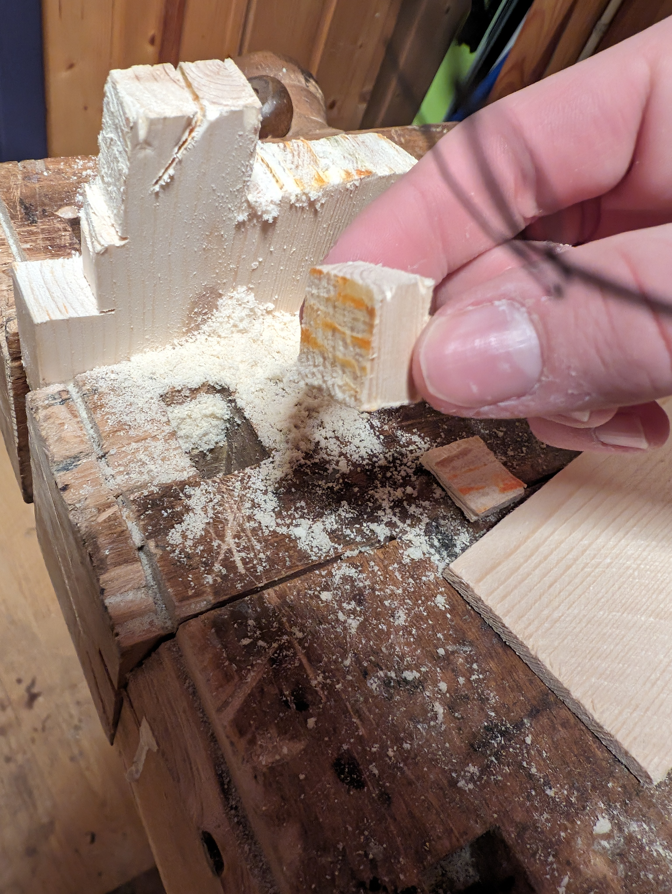

# Smykke logg

## Idé 1, smart smykke

Når jeg først fikk vite at vi skulle lage noe som er et smykke var det første jeg begynte å tenke på var hvordan jeg kunne lage noe med elektronikk.  
Jeg tenkte jeg kunne lage en type smart smykke. Første jeg tenkte var å prøve å ha et kamera som kunne sende det det så til ChatGPT så man kunne få realtime svar på ting. Som hvis du for eksempel ser en plante kan du bruke smykket til å ta et bilde og be chatgpt finne ut hvilke plante det er. Jeg endte ikke opp med å lage en sketch til det her.

Etter litt mere tenking innså jeg at dette kom til å bli et vanskelig prosjekt. Jeg har en vesentlig liten mikrokontroller som kunne kjørt programmet, men hvordan skulle brukeren få svaret fra chatgpt? Jeg tenkte at man kanskje kunne ha en øreplugg koblet til som ga svaret med lyd.

## Idé 2, pip-boy

I spillene fra Fallout serien har de fleste karakterene det som kalles en "pip-boy" som ser sånn her ut:

Pip-boyen er en type datamaskin i form av et stort armbånd. Jeg ville lage en form av det bare litt mindre. Her er min skisse av det, en mikrokontroller men en liten skjerm og noen knapper:

## Problemene

Begge disse to ideene har samme problem, mangel på deler. Jeg har en raspberry pi zero som er en liten Linux datamaskin jeg kan bruke som hjernen i begge prosjektene. Det jeg mangler for begge er ett form for batteri. Man kan jo ikke akkuratt gå rundt med en powerbank i lomma koblet til smykket.

Batteriet jeg hadde trengt å bruke hadde vært et lipo batteri. Eller også kjent som et lithium-ion polymer batteri, det betyr at det polymer electrolyte istedenfor liquid electrolyte som er i vanlige batterier. Disse batteriene er populære på grunn av deres høye energitetthet, som gjør dem lette og kompakte i forhold til andre batterityper. En ulempe med lipo-batterier må behandles forsiktig og lades med spesialiserte ladere for å unngå skade eller brannfare. Dette er ett problem men og så har jeg ikke ett sånt batteri jeg kunne brukt, og siden kriteriene sier at vi ikke kan kjøpe inn noe nytt var begge disse ideene ute av vinduet.

## Magnet smykke

Jeg er usikker på hvor ideen kom fra, men jeg kom på det å bruke magneter for å lage hva jeg refererte til som et "hot-swap" smykke. Hot-swap som i at det er super lett å bytte ut medaljongen, litt som bildekk blir byttet i et Formula 1 race. Dette gjør at man bare trenger ett smykke som kan funke til flere situasjoner. Dette gjør organisering lettere, det er mere bærekraftig, og det er billigere!  
Her er sketchen jeg designet for ideen:

## De to delene

1. **Kjedet**, halskjedet måtte være så basis som mulig så det passet alle typer medalsjonger. I prinsippet var alt det trengte å være en tråd med en magnet. I sketchen jeg lagde tok jeg med at kjedet var flettet og at man festet det sammen bak med to magneter. Dette endret seg underveis, men det kommer jeg tilbake til.

2. **Medaljongen**, medaljongen(e) er det som gjør smykket til ett smykke. Alt medaljongene trengte å være var ett form for design med en magnet festet til.

## Markedsføring

Jeg samarbeidet med Zara og Victoria for å markedsføre dette prosjektet. Vårt hoved salgspunk er hvordan dette kan fikse at smykkeskuffen ser noe sånn her ut:

Med dette smykket kan man heller organisere de forksjellige medaljongene og bare holde styr på ett halskjede!

Ett av våre andre salgspunkt er økosystemet. Fordi det er så lett som en 2x6mm magnet er det super lett å utvide økosystemet med alle mulige medaljonger. Jeg vil fremme at mplet mitt med dette var ikke å lage **ett** fint smykke, men heller noen konsepter for hvordan dette økosystemet vil fungere og kan utvides fremover.

I et helt bedrifts-synspunt kunne vi gått for ett proprietært kobling design så kun vi kunne selge medaljonger. Noe som hadde økt inntekten, men dette er noe jeg er personlig imot og derfor beholder vi den åpne standar tilkoblingen.

## Magnetene

Magnete jeg har valgt å bruke til dette prosjektet er 2mm høye og 6 mm diameter neodymium magneter. Disse magnetene er laget av en blanding av neodymium, jern og bor. Dette gjør magnetene veldig sterke i forhold til størrelsen sin. Utvinning av neodymium kan være miljømessig utfordrende på grunn av behovet for gruvearbeid og kjemisk behandling i etterkant, Men man kan resirkulering neodymium fra brukte magneter som kan bidra til å redusere behovet for ny gruvedrift og redusere miljøpåvirkningen. Disse magnetene hadde jeg en bunke liggende av etter ett annet prosjekt som innvolverte magneter.

## Halskjedet

### Tråden

Halskjedet måtte som jeg har nevnt tidligere være noe veldig enkelt og simpelt. Så jeg gikk å rotet i moren min sin smykkeboks for å se om det var noe tråd jeg kunne gjennbruke. Der fant jeg en smykke tråd. Denne tråden er aget av vokset polyester. Tråden består av polyesterfiber smørt med voks for mere styrke i tråden. Dette gjør at den holder seg bedre mot slitasje, noe som gjør at den kan vare lengre. Generelt sett har polyester et lavere miljøavtrykk enn andre materialer sombomull, da det krever mindre vann og kjemikalier under produksjonen. Tråden har høy kostnadseffektivitet grunnet de enkle materialene noe som gjør det til et propulært valg for smykker.

### 3D printet del

På tråden tredde jeg på denne lille 3D-printete delen. Den hadde jeg lagd tidligere til et annet prosjekt, men den endte med å ikke komme i bruk. Delen er laget av PLA. Denne plastikken er bærekraftig for miljøet da det er nedbrytbart, krever mindre energi og produserer færre skadelige stoffer under 3D-printing sammenlignet med andre filamenter. Forbrenningsprosessen er også mindre skadelig enn for vanlig plast.

På denne limte jeg på en neodymium magnet.

På smykket knøyt jeg en justerbar glidende knute, så man kan justere hvor stort smykket skal være. Dette tok noen forskjøt men etter at jeg fant [denne](https://www.youtube.com/watch?v=nzy1EVmVEv0) veldig gode instruksvideoen fikk jeg det til.

Sånn her ble enderesultatet av halskjedet:

## Hjerte-medaljongen

Den første medaljongen jeg bestemete for å lage var ett hjerte, som sett i skissen min.

### Metall-støping

#### Metallet

Min første ide for å prøve å lage dette smykke var å bruke en form og så smelte metall som kan ta form. Metallet jeg planlo å bruke var blyfritt loddetinn. Blyfritt loddetinn er et alternativ til vanlig bly-innholdig loddetinn. Det er vanligvis laget av en blanding av metaller som tinn, sølv og kobber, og er designet for å være miljøvennlig og tryggere for helseb og miljøet. Bærekraftigheten til blyfritt loddetinn kommer fra elimineringen av bly, som er kjent for å være giftig og skadelig for mennesker og miljøet. Dette metallet var planen å smelte med en loddebolt som er et verktøy med en veldig varm tipp (rundt 250 grader celcius) denne tuppen blir brukt til å smelte metallet.

#### Formen

Formen til hjertet 3D-printet jeg av PLA, som jeg skrev mere om [her](#3d-printet-del). Dette var en veldig enkel hjerte-form som jeg fant på Thingivirse, som er en nettside hvor man kan laste ned 3d-modeller for å 3d-printe.

#### Smeltingen

På skolen tok jeg med meg utstyret og prøvde meg fram:

I starten virket det som at det gikk ganske greit, helt til vi innså dette problemet:

Jeg hadde glemt å tenke på at PLA som formen er laget av har en smelte temperatur på mellom 60 og 155 grader celcius. Når da metallet er rundt 300 grader går jo det selvfølgelig rett gjennom.

#### Research

Når jeg kom hjem den dagen gikk jeg på nettet for å se om noen andre hadde prøvd det samme som meg. Det jeg kom fram til at var at dette var nesten umulig ettersom at man trenger en ordentlig form, men også en ordentlig kjele til å smelte metall i. Pluss at med lodde-tinn metallet jeg brukte ble rundt 50% av metallet smeltet helt bort istedenfor å faktisk bli fast. Dette er ekstremt lite kostnadseffektivt og bærekraftig. Derfor vendte jeg en annen retning.

### Nytt materiale

Materialet som jeg valgte å bytte til for denne medaljongen er treverk. Det er fordi det er ett materialet som er vesentlig lett å jobbe med, og det er miljøvennlig og fornybart, spesielt når man bruker rester fra andre prosjekter som jeg har gjort her.

### Prosessen

Jeg startet med denne blokken med treverk, som jeg sagde en liten kube ut av

For å omgjøre dette til ett hjete måtte jeg kutte ut en enda mindre blokk fra den kuben. Mine første forsøk ble ikke fullt så bra...

Men som de sier, third times the charm:

Nå hadde jeg en fin hjerteform og da var det bare å starte å pusse med sandpapir for å få ett ordentlig hjerte.

Dette var den vanskeligste delen med å lage hjertet, å få formen riktig, men det ble veldig bra når jeg ble ferdig.

### Feste magneten

For å feste magneten måtte jeg feste noe i toppen av hjertet som lot meg lime på magneten. Som man ser i [sketchen](#magnet-smykke) så er det en type stang som står opp fra midten. Jeg kunne ikke bare hamre inn en vanlig spiker, ettersom at det hadde risikert at hjertet sprakk opp. Derfor valgte jeg å bruke et 2mm borr som jeg da kunne putte en spiker nedi.

Jeg festet en bit med maskeringsteip på toppen så jeg kunne sørge for at jeg ikke drillet gjennom hjertet med uhell.

I min første test drillet jeg bare inn i en test planke for å se hvordan jeg skulle gjøre dette, jeg prøvde først med en bit ståltråd:

Dette hadde vært et godt valg med tanke på kostnadseffektivitet, da man kan kjøpe en stor mengde ståltråd for en billig penge. Ulempen her var at den ikke satt særlig bra i hullet jeg hadde borret, og ikke hadde jeg noe mindre borr heller. Og ståltråden var altfor myk noe som gjorde at den ikke holdt seg bra. Og det kunne ført til at den knakk. Noe som i motsigelse hadde gjort det mindre bærekraftig og kostnadseffektivt hvis den ble ødelagt hele tiden.

Etter å ha skrotet rundt i kjelleren fant jeg disse spikerene her, de er opprinnelig laget for å henge opp bilder, men funker perfekt.

Denne spikeren hadde disse verdiene som gjorde den perfekt:

- Størrelse. Den passet perfekt ned i hullet jeg hadde borret til den.
- Utseende. Fordi den er laget til å henege opp bilder er den laget med tanken om at man skal kunne se den som gjør at den ser finere ut enn vanlige spikre.
- Flat topp. Toppen av spikren er helt flat som gjør den perfekt til å lime en magnet på.
- Kostnadseffektivithet og bærekraft. Disse spirkene er relativt billig å produsere, og kan bruke gjennbrukt stål som en bærekraftig produksjonsmetode.

Jeg var nøtt til å kutte ned spikeren til en litt mindre lengde for at den ikke skulle stikke altfor langt ut fra hjertet, det gjorde ved hjelp av en avbitertang.

### Maling

Før jeg kunne lime spikeren fast ville jeg male hjertet. Dette er for å forhindre at maling kom på selve spikeren som jeg ville skulle stå litt ut. Det sto mellom å lakkere det eller male det. Lakken hadde gitt det en veldig fin trefarge, men uheldigvis så har jeg ikke noe lakk for treverk liggende. Derfor gikk jeg for maling.

#### Malingen

Malingen jeg brukte var en rød citadel colour maling. Dette er et hobby produkt originalt laget for maling av miniatyr figurer, men det funket veldig bra. Jeg vet desverre lite om produksjonen til denne malingen og kan derfor ikke si velsig mye om bærekraftigheten og kostnadseffektiviteten. Annet enn at dette er et veldig kjent selskap så det har mest sannsynlig god kvalitets kontroll.

#### Ferdig malt:

Magneten limte jeg bare på toppen med superlim.

### Fullført hjerte

Etter dette var det bare å smøre litt superlim på spikeren og la det stå over natten, og så var hjerte medaljongen ferdig!

## Navne medaljong

Jeg visste fra starten at jeg ville lage en medaljong som kunne bli tiplasset av kjøperen, og det jeg ville ha var navnet.

### Brenne inn

Først prøvde jeg å se om jeg kunne lage ett design på en tynn treplate ved å brenne det inn med loddebolten min, som det her:

Jeg innså fort at dette ikke kom til å gå ettersom at det var vanseklig å lage noe fint og nøyaktig med denne metoden.

### Kube med maling

Jeg så nå for meg heller bare en liten avlang kube med litt pusset hjørner hvor jeg kunne male på forbokstaven i ett navn. Desverre tegnet jeg ikke noen skisse til dette fordi jeg så det så godt for meg.

Jeg startet med å kutte ut en liten treblokk, den oransje fargen man ser er overført fra malingen på sagen.

Denne kuben pusset jeg til den hadde en brukbar form:

Etter dette gjorde jeg det samme som jeg gjorde på hjertet med borret og spikeren:

Jeg malte kuben med ett lag svart maling først, så etter det hadde tørket malte jeg på en "S" i hvit maling på midten og la til litt sølv maling i kanten. Malingen jeg brukte var av samme type som jeg brukte på hjertet. Magneten limte jeg også bare på toppen her med superlim.

### Fullført:

Male fersighetene mine er ikke helt på topp så jeg ble ikke super fornøyd med "S"en, men jeg prøvde så godt jeg kunne og til slutt ble det helt greit.

## Sprøsmålstegn

Jeg ville ha en måte å symbolisere at man kunne ha hvilkesomhelst bokstav på medaljongen, så jeg lagde en med ett spørsmålstegn. Her repeterte jeg bare akkuratt samme prosess som på den med "S", uheldigvis var jeg tom for hvit maling og måtte bruke en annen vann basert maling som gjorde at tegnet ble mye mindre tydelig. Dette var uheldigvis ikke noe jeg fikk til å fikse, selvom jeg prøvde flere ganger med blant annet å legge flere lag.

## Bilder

Her er noen bilder Zara og Victoria tok av produktet:

